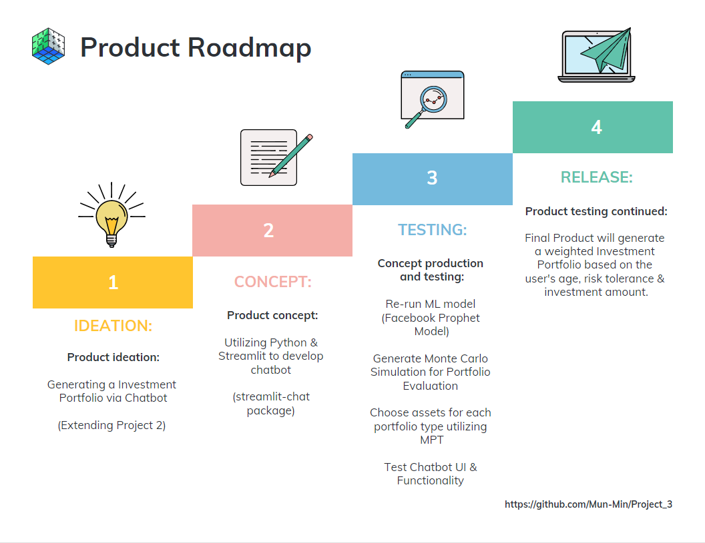
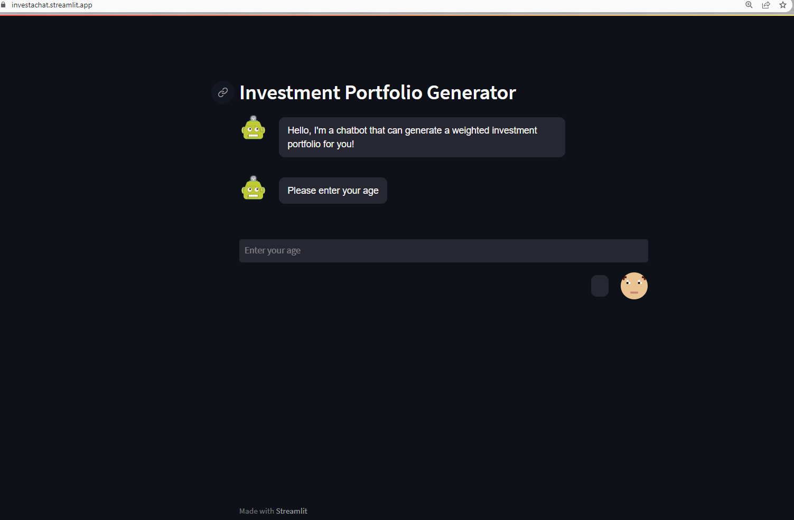

# Developing an Investment Portfolio via ChatBot

## Table of Contents:
1. [Summary](#summary)

2. [Data Techniques](#data-techniques)

3. [ChatBot Development](#chatbot-development)
   
4. [Conclusion](#conclusion)

---

## Run the ChatBot using Streamlit Cloud:

Link to ChatBot --> https://investachatbot.streamlit.app/ 

## Run the ChatBot Locally:
You must download the following packages in order to run the ChatBot:

    <b>Run ChatBot:</b>

    streamlit run chatbot.py

    <b>Python (version 3.9.12):</b>

    pip install python==3.9.12

    <b>Streamlit-Chat Package (version 0.0.2.1):</b>

    pip install streamlit-chat
    from streamlit_chat import message

    <b>Streamlit Package (version 1.15.2):</b>

    pip install streamlit
    conda install -c conda-forge streamlit
    import streamlit as st

    <b>Plotly Package (version 5.9.0):</b>

    pip install plotly
    conda install -c plotly plotly
    import plotly.express as px
    import plotly.graph_objects as go

---

  

> Note:
> Our team was interested in expanding our previous project:
[Developing an Investment Portfolio Utilizing Machine Learning](https://github.com/Mun-Min/Project_Two)

## Summary:

    <b>A:</b>

* According to the Rule of 110, the percentage of your retirement portfolio that should be invested in stocks should be calculated by subtracting your age from 110. For instance, if you are 30, this rule suggests that you should allocate 80% of your portfolio to stocks and the rest to other non-stock investments. However, some current investment advice recommends including a small portion, ranging from 1-5%, of cryptocurrency investments in a retirement portfolio. The rest of the portfolio should be divided between investments in bonds and real estate investment trusts (REITs).
  
  * To enhance our project, we have decided to add in Bitcoin and Ethereum, which are the two largest cryptocurrencies in terms of market cap.
  * Assets chosen to be included in portfolio:

    * Top 25 SP500 Stocks (ranked by marketcap)
    * 10-yr Treasury Bond, 30-yr Treasury Bond
    * Bitcoin, Ethereum

    <b>B:</b>

* Utilize FaceBook's Prophet Forecasting ML Model to forecast adjusted close prices of each asset for the next 30 days.

    <b>C:</b>

* Run Monte Carlo Simulations to also include long-term projections to furthur analyze the portfolio.

## Data Techniques:

Data Sources: Yahoo Finance Python Package

* Stocks [Top 25 SP500]
* Bonds [10 yr & 30 yr Treasury Yield]
* Crypto [BTC & ETH]

Gathered 10 years of Historical Data

## ChatBot Development:

After doing extensive research on how to create a chatbot via Streamlit & Python, we came across a special streamlit package called streamlit-chat! This package allowed us to create a simple UI that mimics the look and functionality of a chatbot.

ChatBot Main Files:

  * [chatbot.py](./chatbot.py)
  * [chatbot_functions.py](./chatbot_functions.py)

`The chatbot.py file runs the functions located in chatbot_functions.py to produce the necessary results.`

Functions in chatbot_functions.py:

  * verifyUserAge

    * verify if the user is old enough to use the application

  * determine_weights

    * determine the portfolio weights based off of the user's age

  * allocate_portfolio

    * allocate the user's investment amount towards each asset class according to the portfolio weights

  * display_portfolio_allocation

    * display a donut chart visualization of the user's portfolio allocation
  
  * display_forecasts

    * display Prophet Forecasts to the user along with historical prices

  * run_MC_simulation

    * run a Monte Carlo Simulation based on the selected portfolio type

> After much deliberation, the team decided to offer three portfolio options for the user to choose from: high risk, low risk, and moderate risk. The chatbot will then create a portfolio with assets that align with the chosen level of risk. 

## Conclusion:

Our objective in the preceding project was to build a chatbot that could generate an investment portfolio based on particular user inputs. Unfortunately, we were unable to achieve this due to certain knowledge shortages. However, upon learning how to use Streamlit to design easy but stylish user interfaces, we as a team chose to try again to create a chatbot that can generate an investment portfolio for the user using Streamlit & Python.
